# Diffusion Model
It consist of two process:
1. Forward Process
2. Reverse Process

**Forward Process:** 

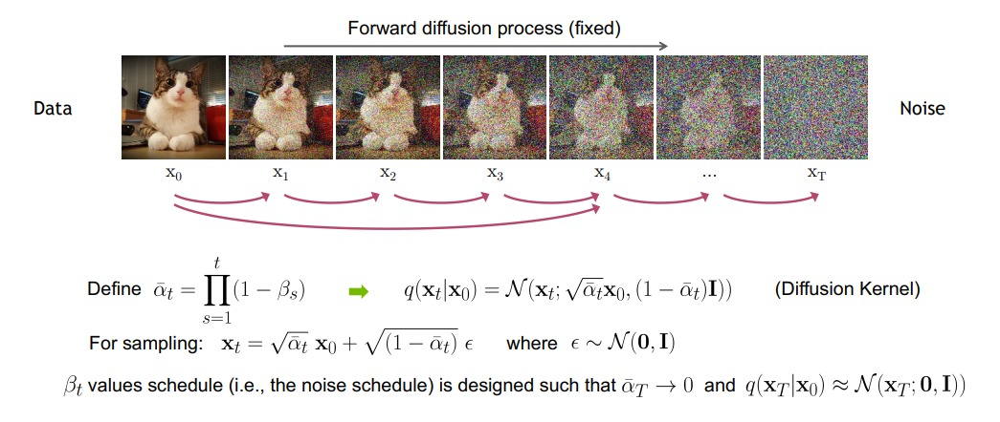

In the forward process we add noise to the input image. We don't add same amount of noise each time, 
this regulated by the scheduler which scales mean and var of noise. This ensures variance does not explode as we add more and more noise.
Different Scheduler:
1. Linear Scheduler
2. Cosine Scheduler

**Reverse Process:** 

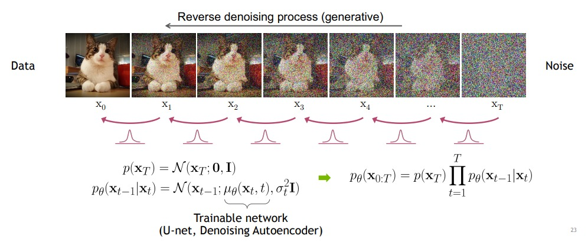

 The reverse process of diffusion models is the process of generating new data by starting from a noisy image and gradually removing the noise. This is done by iteratively applying a neural network to the image, which learns to reverse the diffusion process that was used to create the noisy image in the first place.

**Model:**

## DDPM
- [U-Net](https://arxiv.org/pdf/1505.04597.pdf) like architecture, it takes image ans input and using ResNet block and down-sample block project image to small resolution.
- After bottleneck it uses up-sample project back to original image size.
- Author puts attention block at bottlenek and also included skip connection between layers of same resolution.
- Sinusoidal time embedding is projected into each residual block for forward and reverse diffusion process for making at different time steps.

## Diffusion Models Beat GANs on Image Synthesis

*Updates*
- Increasing depth versus width, holding model size relatively constant.
- Increasing the number of attention heads.
- Using attention at 32×32, 16×16, and 8×8 resolutions rather than only at 16×16.
- Using the BigGAN residual block for upsampling and downsampling the activations.
- Rescaling residual connections with $1/\sqrt{2}$.
- Classifier Guidance
- Adaptive Group Normalization

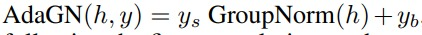

  $y_{s}$ : linear projection of time step; 
  $y_{b}$ : linear projection of class label
   
Model Prediction - Noise of Image

**Why Reverse Process of Diffusion Model removes noise step by step?**

Learning in this framework involves estimating small perturbations to a diffusion process.
Estimating small perturbations is more tractable than explicitly describing the full
distribution with a single, non-analytically-normalizable,
potential function. Furthermore, since a diffusion process
exists for any smooth target distribution, this method can
capture data distributions of arbitrary form. [Deep Unsupervised Learning](https://arxiv.org/pdf/1503.03585.pdf)

# Math behind Diffusion Models
## Notation :
- $x_{t}$ : Image after t iteration of adding noise.
- $x_{T}$ : Final image following isotropic Gaussian
- $q(x_{t}| x_{t-1})$ : Forward Process
- $p(x_{t-1}| x_{t})$ : Reverse Process 
- $β_{t}$ : Variance schedule, range[0,1], start small and gets increased
- $α_{t}$ =  $1 - β_{t}$
- $\bar{α_{t}}$ = $\prod_{s=1}^{t} α_{s}$ 
- $ϵ_{t} \sim N(0, I)$
- $\bar{ϵ}_{t-2}$ : merage of two gaussian 

## Equations : 

- $q(x_{t}| x_{t-1}) = \mathcal{N}(x_{t}; \sqrt{1-β_{t}} \cdot  x_{t-1}, β_{t}I)$

  Above equation adds noise step by step. There is a better way of doing it.

  $q(x_{t}| x_{t-1}) = \mathcal{N}(x_{t}; \sqrt{1-β_{t}} \cdot  x_{t-1}, β_{t}I)$

  $= \sqrt{1-β_{t}} \cdot  x_{t-1}+ \sqrt{β_{t}} \cdot ϵ_{t-1}$  
  $= \sqrt{α_{t}} \cdot  x_{t-1}+ \sqrt{1-α_{t}} \cdot ϵ_{t-1}$
  $= \sqrt{ α_{t} \cdot α_{t-1}} \cdot  x_{t-2}+ \sqrt{1-α_{t} \cdot α_{t-1}} \cdot \bar{ϵ}_{t-2}$

  $= \cdot \cdot \cdot$

  $= \sqrt{ \bar{α_{t}} } \cdot  x_{0}+ \sqrt{1-\bar{α_{t}}} \cdot ϵ$

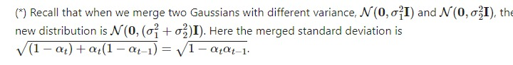

  which results in next equation
  
- $q(x_{t}| x_{0}) = \mathcal{N}(x_{t}; \sqrt{\bar{α_{t}}} \cdot  x_{0}, (1 - \bar{α_{t}})I)$
- $p(x_{t-1}| x_{t}) =  \mathcal{N}(x_{t}; \mu_{Θ}(x_{t}, t),\Sigma_{Θ}(x_{t}, t) )$ 

  In tis case we have two parameters which characterize the normal distribution.

  We fix the variance to certain schedule. We don't need to predict it.

# Loss
$Loss = -log(p_{\theta}(x_{0}))$ can't be used as it is intractable. Since $x-{0}$ is dependent on $x_{1}, x_{2},...x_{T}$.
So , we use the following loss function.

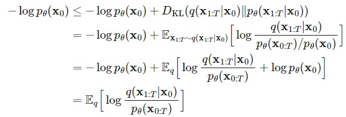

from first term to second term can be arrived by using Bayes Rule $P(A|B) = \frac{P(AB)}{P(B)}$. we know,

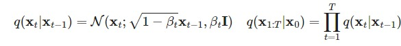

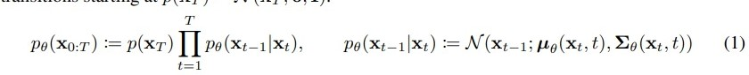

Proceeding for further simplification:

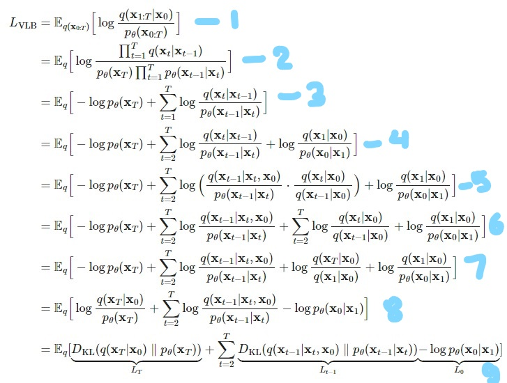.
- $2^{nd}$ eq to $3^{rd}$ eq arrived by separating out $-log p_{\theta}(x_{T})$ term.
- $3^{rd}$ eq to $4^{th}$ eq arrived by separating out $-log \frac{q(x_{1}|x_{0})}{p(x_{1}|x_{0})}$.
- In $4^{th}$ eq ${q(x_{t}|x_{t-1})} = \frac{q(x_{t-1}|x_{t})\cdot q(x_{t})}{q(x_{t-1})}$. Each term in the RHS have really high variance since we don't know what we have really started with. So, we also make conditioning it to the $x_{0}$ which drtaically reduces the variance. ths lead from the $4^{th}$ eq to $5^{th}$ eq.
- In $5^{th}$ eq we have splitted the $3_{rd}$ term of $4_{th}$ eq splitting i.e., log term 
- For $6^{th}$ eq : changing mutiplication to sum of $2^{nd}$ term of $5^{th}$ eq.
- On Solving $3^{rd}$ term of $6^{th}$ eq we get $7^{th}$ eq.
-By solving and rearranging $1^{st}$, $3^{rd}$ and $4^{th}$ term of $7^{th}$ eq we get $8^{th}$ eq.

### Inferance from final loss function:``
Every KL term in final eq. is between two Gaussian distributions and therefore they can be computed in closed form.
(except for last term)

1. **$1^{st}$ term is the prior matching term.**

We ignore the fact that the forward process variances βt are learnable by reparameterization and
instead fix them to constants. Thus, in our implementation, the approximate
posterior q has no learnable parameters, so **$L_{T}$ is a constant during training and can be ignored.**

2. **$3^{rd}$ term is the reconstruction loss**.

This can be easily computed

3. **$2^{nd}$ term is denoising matching term**.

Uses KL divergence to directly compare $p_{θ}(x_{t−1}|x_{t})$ against forward process posteriors, which are tractable
when conditioned on $x_{0}$.
In turn this results in following form for $q$

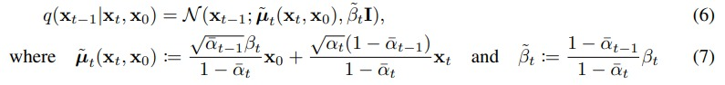

Since, var: $\bar{\beta_{t}}$ is fixed. Focus on $\bar{\mu_{t}}$ wich is something like weighted average.
Here, $x_{0}$ can rewritten as: 

$x_{0} = \frac{1}{\sqrt{\bar{\alpha_{t}}}} \cdot (x_{t} - \sqrt{1-\bar{\alpha_{t}}} \cdot \bar{ϵ}_{t})$, 

substituting value of $x_{0}$ in $\bar{\mu_{t}} $ we get:

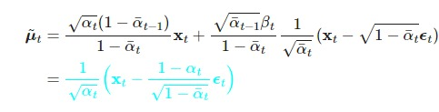

we care just subtracting random scaled noise from $x_{t}$ and scaling it by $\frac{1}{\sqrt{\bar{\alpha_{t}}}}$.

we need to learn a neural network to approximate the conditioned probability distributions in the reverse diffusion process, $p(x_{t-1}| x_{t}) =  \mathcal{N}(x_{t}; \mu_{Θ}(x_{t}, t),\Sigma_{Θ}(x_{t}, t) )$. We would like to train to $\mu_{\theta}$ to predict  $\bar{\mu_{t}}$. Because $x_{t}$ is available as input at training time, we can reparameterize the Gaussian noise term instead to make it predict $ϵ_{t}$ from the input $x_{t}$ at time step $t$. 

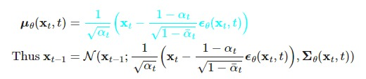

To represent $\mu_{\theta}$, author proposed a specific parameterization between actual $\tilde{\mu_{t}}$ and predicted $\mu_{\theta}$. **Loss**

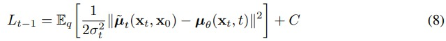

where C is a constant that does not depend on θ. The most straightforward parameterization of $\mu_{\theta}$
is a model that predicts $\tilde{\mu_{\theta}}$ , the forward process posterior mean.

Using reparameterization :
 

$q(x_{t}| x_{0}) = \mathcal{N}(x_{t}; \sqrt{\bar{α_{t}}} \cdot  x_{0}, (1 - \bar{α_{t}})I)$  to

$x_{0}(x_{t}, ϵ) = \sqrt{\bar{\alpha_{t}}} \cdot x_{0} + \sqrt{1-\bar{\alpha_{t}}} \cdot ϵ $

Now on substituting the value of  $\tilde{\mu_{t}} = \frac{1}{\sqrt{\alpha_{t}}} \cdot (x_{t} - \frac{\beta_{t}}{\sqrt{1-\bar{\alpha_{t}}}} \cdot ϵ)$ from one of the blue colored equation.
We get following form on substituting:

$L_{t-1} - C =$

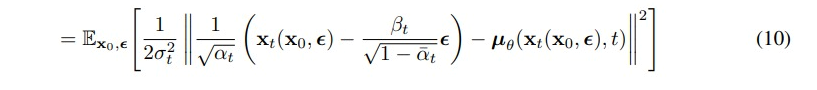

$\mu_{\theta}$ must predict $\frac{1}{\sqrt{\alpha_{t}}} \cdot (x_{t} - \frac{\beta_{t}}{\sqrt{1-\bar{\alpha_{t}}}} \cdot ϵ)$
given $x_{t}$. Since $x_{t}$ is available as
input to the model, we may choose the parameterization

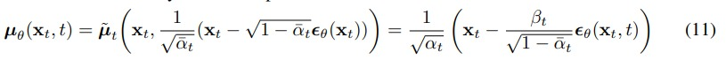

where $ϵ_{\theta}$ is a function approximator intended to predict ϵ from $x_{t}$. Which results in following equation:

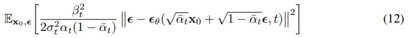

which resembles denoising score matching over multiple noise scales indexed by t.

## SUMMARY
To summarize, we can train the reverse process mean function approximator $\mu_{\theta}$ to predict $\tilde{\mu_{t}}$, or by
modifying its parameterization, we can train it to predict ϵ.

## Algorithm
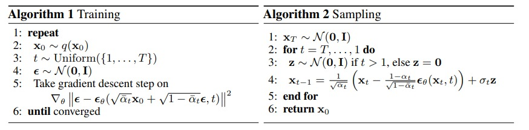

During Sampling at t=1 there is no point ofa adding noise as we are already at the end of the diffusion process i.e., $x_{0}$. Adding noise to it will make it more noisy.

## Objective Function
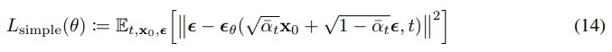

Inner term, can be written as: 
$|| ϵ - ϵ_{\theta}(x_{t}, t) ||^2$

# Resources
- [Deep Unsupervised Learning](https://arxiv.org/pdf/1503.03585.pdf)
- [DDPM](https://arxiv.org/pdf/2006.11239.pdf)
- [Blog Post](https://lilianweng.github.io/posts/2021-07-11-diffusion-models/)
- [minDiffusion github](https://github.com/cloneofsimo/minDiffusion)
- [Arash YT  DDPM ](https://www.youtube.com/watch?v=cS6JQpEY9cs&t=1216s&ab_channel=ArashVahdat)
- [Outlier YT DDPM](https://www.youtube.com/watch?v=HoKDTa5jHvg&t=1453s&ab_channel=Outlier)
